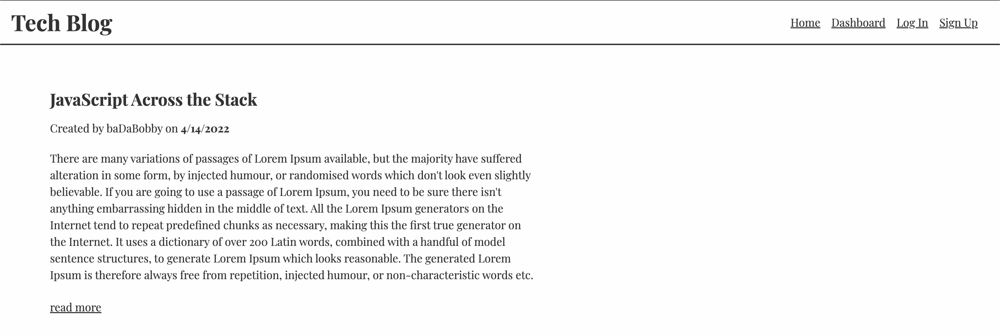

# Tech Blog

## Description
This a simple blog application that runs on Heroku using the JAWS DB resource as a database to manage users, blog entries, comments, etc. 

## Table of Contents
- [Description](#description) 
- [Installation](#installation)
- [Contribution](#contribution)
- [License](#license)
- [Questions](#questions)
  

## Installation
1. Clone repo from gitHub via SSH or HTTPS
2. Open the application at the root level in a terminal window
3. Run 'npm i'  
4. Delete .EXAMPLE from the .env and input your mysql crednetials. For the DB_NAME variable, assign a value of 'techblog'
4. Log into mysql and run 'source db/schema.sql' ... you can quit mysql at this time
5. (Optional) Run 'npm run seed' to seed the database with the provided examples
6. Run 'npm start' 
7. In a web browser, navigate to port where application is running. 
App will listen on PORT :3001 if running from localhost, or data from process.env.PORT if running from app server (i.e. Heroku)
<http://localhost:3001> will render a webpage with data from both tables

App will use local .env for database connection if running from localhost, or data from process.env if running from app server (i.e. Heroku)
App will use local .env and settings in connection.js for database connection if running from localhost, or data from process.env to include JAWS_DB if running from app server (i.e. Heroku)

## Live Application

[Deployed on Heroku](https://whispering-lake-40358.herokuapp.com/)

## Contribution
If you'd like to contribute, ask to be added to the project as collaborator. Once added, submit a pull request for any changes made to the codebase. Follow basic contribution guidelines and coding etiquette, please.

## License
 

This project is covered by MIT

## Questions
Look for us on GitHub at: 
* [n-r-martin](https://github.com/n-r-martin)  
* hello@nickmartin.design

